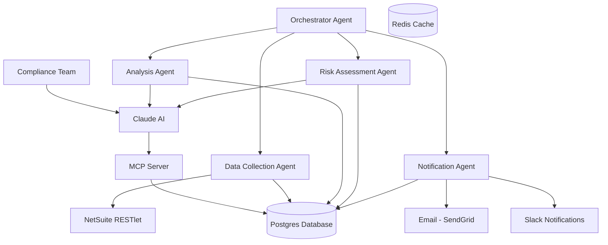
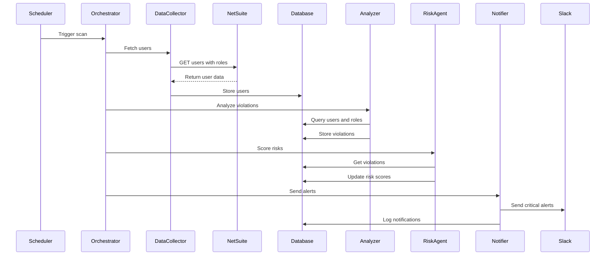
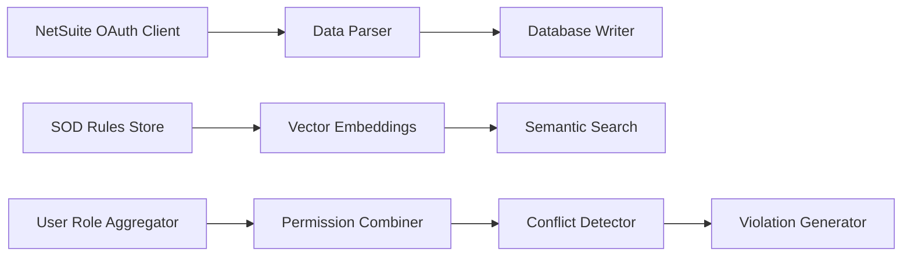
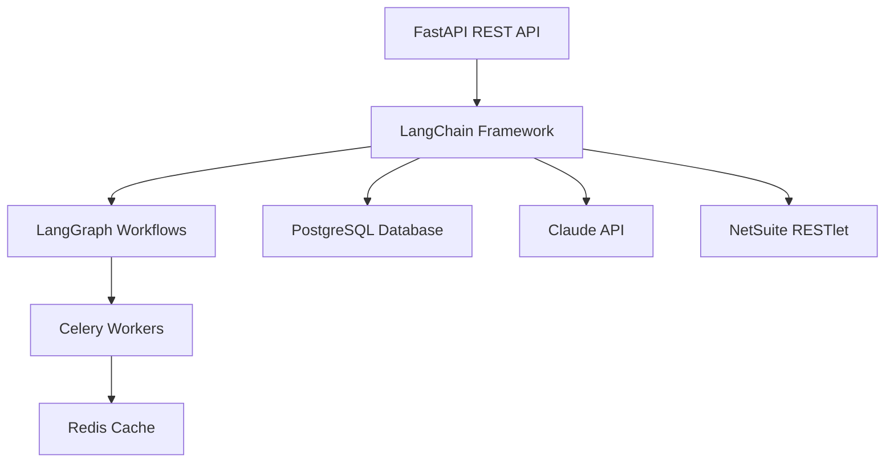
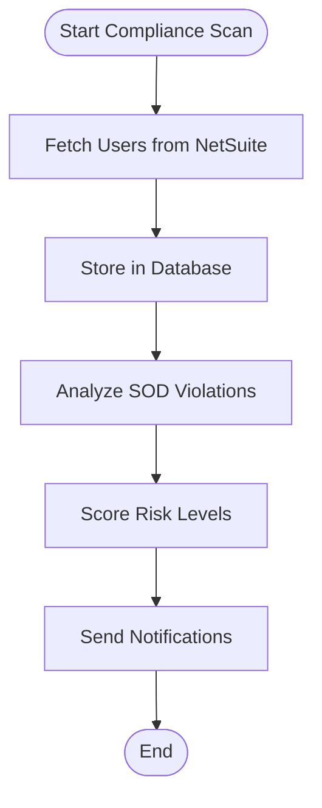
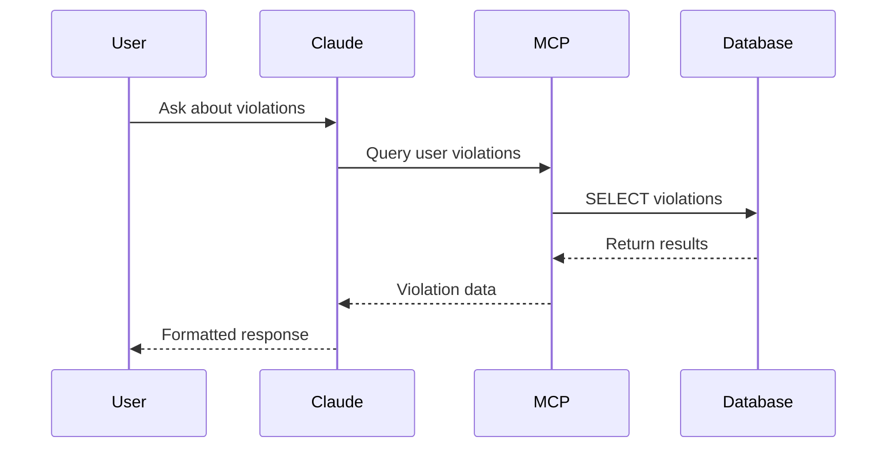

# SOD Compliance - Lucidchart Compatible Diagrams

## Diagram 1: System Overview (Simplified)



## Diagram 2: Data Flow Sequence



## Diagram 3: Agent Components



## Diagram 4: Technology Stack



## Diagram 5: Simple Workflow



## Diagram 6: MCP Interaction



---

## Alternative: Simple Box Diagram (Always Works)

If Mermaid still fails, here's a plain text version you can manually create:

```
┌─────────────────────────────────────────────────────────┐
│                   SOD COMPLIANCE SYSTEM                  │
└─────────────────────────────────────────────────────────┘

┌──────────────────┐         ┌──────────────────┐
│  HUMAN INTERFACE │         │  AUTOMATED AGENTS │
│                  │         │                  │
│  • Claude.ai     │         │  • Orchestrator  │
│  • MCP Server    │         │  • Data Collector│
│  • Ad-hoc Queries│         │  • Analyzer      │
│                  │         │  • Risk Assessor │
│                  │         │  • Notifier      │
└────────┬─────────┘         └────────┬─────────┘
         │                            │
         └──────────┬─────────────────┘
                    │
         ┌──────────▼─────────┐
         │   DATA LAYER       │
         │                    │
         │  • Postgres DB     │
         │  • pgvector        │
         │  • Redis Cache     │
         └──────────┬─────────┘
                    │
         ┌──────────▼─────────┐
         │  EXTERNAL SERVICES │
         │                    │
         │  • NetSuite        │
         │  • Claude API      │
         │  • SendGrid        │
         │  • Slack           │
         └────────────────────┘

DATA FLOW:
1. NetSuite → Users & Roles → Postgres
2. Postgres → Analyzer → Violations
3. Violations → Risk Scoring → Notifications
4. Humans → MCP → Postgres → Insights
```

---

## Tips for Lucidchart

If you're still having issues:

1. **Import one diagram at a time** - Don't paste all at once
2. **Use flowchart instead of graph** - Change `graph TB` to `flowchart TD`
3. **Remove special characters** - Simplify node labels
4. **Use basic syntax** - Avoid advanced features like styling

Try starting with **Diagram 5 (Simple Workflow)** - it's the most compatible!
