# Database UML Diagram

## Entity Relationship Diagram

```mermaid
erDiagram
    users ||--o{ user_roles : has
    users ||--o{ violations : has
    users ||--o{ violation_exemptions : requests
    users ||--o{ access_request_analyses : requests

    roles ||--o{ user_roles : assigned_to
    roles ||--o{ role_internal_conflicts : contains

    sod_rules ||--o{ violations : triggers
    sod_rules ||--o{ violation_exemptions : exempts

    compliance_scans ||--o{ violations : finds

    users {
        uuid id PK
        varchar user_id UK "NetSuite ID"
        varchar internal_id UK
        varchar name
        varchar email UK
        userstatus status
        varchar department
        varchar subsidiary
        varchar employee_id
        varchar job_function
        varchar business_unit
        varchar title
        varchar supervisor
        varchar supervisor_id
        varchar location
        timestamp hire_date
        timestamp synced_at
        timestamp created_at
        timestamp updated_at
    }

    roles {
        uuid id PK
        varchar role_id UK "NetSuite Role ID"
        varchar role_name
        boolean is_custom
        text description
        integer permission_count
        json permissions
        vector_384 embedding "pgvector"
        timestamp created_at
        timestamp updated_at
    }

    user_roles {
        uuid id PK
        uuid user_id FK
        uuid role_id FK
        timestamp assigned_at
        varchar assigned_by
        text notes
    }

    sod_rules {
        uuid id PK
        varchar rule_id UK
        varchar rule_name
        varchar category
        text description
        json conflicting_permissions
        violationseverity severity
        boolean is_active
        vector_384 embedding "pgvector"
        varchar principle
        varchar category1
        varchar category2
        integer base_risk_score
        jsonb level_conflict_matrix
        jsonb resolution_strategies
        timestamp created_at
        timestamp updated_at
    }

    violations {
        uuid id PK
        uuid user_id FK
        uuid rule_id FK
        uuid scan_id FK
        violationseverity severity
        violationstatus status
        float risk_score
        varchar title
        text description
        json conflicting_roles
        json conflicting_permissions
        timestamp detected_at
        timestamp resolved_at
        varchar resolved_by
        text resolution_notes
        vector_384 embedding "pgvector"
        json violation_metadata
    }

    role_internal_conflicts {
        integer id PK
        varchar role_id FK
        varchar role_name
        varchar conflict_category
        varchar conflict_name
        varchar severity
        text pattern_description
        jsonb permissions_involved
        timestamp analysis_timestamp
        timestamp created_at
    }

    compliance_scans {
        uuid id PK
        varchar scan_type
        scanstatus status
        timestamp started_at
        timestamp completed_at
        float duration_seconds
        integer users_scanned
        integer violations_found
        integer violations_critical
        integer violations_high
        integer violations_medium
        integer violations_low
        varchar triggered_by
        json filters_applied
        text error_message
        json scan_metadata
    }

    violation_exemptions {
        uuid id PK
        uuid violation_id FK
        uuid user_id FK
        uuid rule_id FK
        varchar reason
        text rationale
        text business_justification
        text compensating_controls
        exemptionstatus status
        varchar requested_by
        timestamp requested_at
        varchar approved_by
        timestamp approved_at
        text approval_notes
        varchar rejected_by
        timestamp rejected_at
        text rejection_reason
        timestamp expires_at
        timestamp last_reviewed_at
        timestamp next_review_date
        boolean auto_approved
        float risk_score
        varchar risk_acceptance_level
        vector_384 embedding "pgvector"
        json exemption_metadata
        timestamp created_at
        timestamp updated_at
    }

    knowledge_base_documents {
        uuid id PK
        varchar doc_id UK
        varchar doc_type
        varchar title
        text content
        varchar reference_id
        varchar reference_table
        vector_384 embedding "pgvector"
        varchar_array tags
        varchar category
        timestamp created_at
        timestamp updated_at
        jsonb metadata
    }

    job_role_mappings {
        uuid id PK
        varchar job_role_id
        varchar job_title
        varchar department
        jsonb typical_netsuite_roles
        jsonb acceptable_role_combinations
        jsonb not_recommended_combinations
        varchar typical_resolution_strategy
        varchar_array typical_required_controls
        boolean requires_manager_approval
        boolean requires_executive_approval
        boolean requires_audit_review
        varchar default_approval_level
        text business_justification
        text_array restrictions
        boolean is_active
        timestamp created_at
        timestamp updated_at
        jsonb metadata
        boolean requires_compensating_controls
        text_array typical_controls
    }

    access_request_analyses {
        uuid id PK
        varchar analysis_id UK
        varchar user_id
        varchar job_title
        varchar_array requested_roles
        integer conflicts_found
        varchar overall_recommendation
        varchar overall_risk
        jsonb job_role_validation
        jsonb conflicts
        jsonb resolutions
        timestamp analyzed_at
        varchar analyzer_version
        jsonb metadata
    }

    compensating_controls {
        uuid id PK
        varchar control_id UK
        varchar name
        varchar control_type
        text description
        integer risk_reduction_percentage
        text_array implementation_steps
        integer implementation_time_hours
        text technical_requirements
        varchar annual_cost_estimate
        varchar setup_cost_estimate
        boolean is_active
        timestamp created_at
        timestamp updated_at
        jsonb metadata
    }
```



## Table Categories

### Core Identity & Access
- **users** - User accounts from NetSuite/Okta
- **roles** - NetSuite roles with permissions
- **user_roles** - Assignment of roles to users

### SOD Compliance
- **sod_rules** - Segregation of duties conflict rules
- **violations** - Detected SOD violations
- **violation_exemptions** - Approved exceptions to violations
- **compliance_scans** - Compliance scan history

### Role Analysis
- **role_internal_conflicts** - Internal SOD conflicts within single roles
- **access_request_analyses** - Analysis of access requests
- **job_role_mappings** - Job title to NetSuite role mappings

### Knowledge Base
- **knowledge_base_documents** - Vector-searchable compliance knowledge
  - SOD rules
  - Role conflict patterns
  - Resolution strategies
  - Compliance documentation

### Controls
- **compensating_controls** - Compensating control catalog

## Key Relationships

### User-Role Assignments
```
users (1) ----< user_roles (M) >---- (1) roles
```
Many-to-many: Users can have multiple roles, roles can be assigned to multiple users

### Violations
```
users (1) ----< violations (M)
sod_rules (1) ----< violations (M)
compliance_scans (1) ----< violations (M)
```
A violation is detected when a user's role combination conflicts with an SOD rule during a scan

### Role Internal Conflicts
```
roles (1) ----< role_internal_conflicts (M)
```
A single role can have multiple internal SOD conflicts (e.g., maker-checker violations)

### Violation Exemptions
```
violations (1) ---- (0..1) violation_exemptions
users (1) ----< violation_exemptions (M)
sod_rules (1) ----< violation_exemptions (M)
```
Exemptions can be granted for specific violations, users, or rules

## Vector Embeddings (pgvector)

The following tables use pgvector for semantic search:

1. **roles.embedding** - Role semantic representation based on permissions
2. **sod_rules.embedding** - Rule semantic representation for similarity matching
3. **violations.embedding** - Violation semantic representation for pattern detection
4. **violation_exemptions.embedding** - Exemption semantic representation
5. **knowledge_base_documents.embedding** - Document semantic representation for RAG

## Custom PostgreSQL Types

```sql
-- User status enum
CREATE TYPE userstatus AS ENUM ('ACTIVE', 'INACTIVE', 'DISABLED');

-- Violation severity enum
CREATE TYPE violationseverity AS ENUM ('CRITICAL', 'HIGH', 'MEDIUM', 'LOW');

-- Violation status enum
CREATE TYPE violationstatus AS ENUM ('OPEN', 'IN_REVIEW', 'RESOLVED', 'EXEMPTED', 'DISMISSED');

-- Scan status enum
CREATE TYPE scanstatus AS ENUM ('PENDING', 'RUNNING', 'COMPLETED', 'FAILED');

-- Exemption status enum
CREATE TYPE exemptionstatus AS ENUM ('PENDING', 'APPROVED', 'REJECTED', 'EXPIRED', 'REVOKED');
```

## Indexes

### Performance Indexes
- `users`: email, internal_id, status+email, department, job_function
- `roles`: role_id
- `user_roles`: user_id+role_id (composite unique)
- `sod_rules`: rule_id, category, category1+category2
- `violations`: user_id+status, status+severity, detected_at
- `role_internal_conflicts`: role_id, severity, category, timestamp
- `compliance_scans`: started_at, status

### Vector Similarity Indexes
- `knowledge_base_documents.embedding`: IVFFlat index for vector_cosine_ops

## Data Flow

### 1. Data Collection (Autonomous Agent)
```
NetSuite RESTlet → NetSuiteConnector → users, roles → sync_metadata
```

### 2. Violation Detection
```
SODAnalysisAgent → sod_rules + users + user_roles → violations
```

### 3. Role Conflict Analysis
```
analyze_all_roles_internal_sod.py → roles.permissions → role_internal_conflicts
```

### 4. Knowledge Base Enrichment
```
role_internal_conflicts → ingest_role_conflicts_to_kb.py → knowledge_base_documents
```

### 5. Semantic Search
```
User Query → EmbeddingService → knowledge_base_documents.embedding → Relevant Documents
```

## Storage Estimates

| Table | Estimated Rows | Notes |
|-------|---------------|-------|
| users | 100-1,000 | Active employees |
| roles | 30-100 | NetSuite roles |
| user_roles | 200-5,000 | Avg 2-5 roles per user |
| sod_rules | 10-50 | Curated conflict rules |
| violations | 100-10,000 | Depends on conflict prevalence |
| role_internal_conflicts | 20-50 | Roles with internal conflicts |
| knowledge_base_documents | 50-500 | Grows with analysis |
| compliance_scans | 100-1,000 | Historical scans |
| violation_exemptions | 10-500 | Approved exceptions |

## Maintenance

### Regular Tasks
- **Daily**: Sync users/roles from NetSuite
- **Hourly**: Incremental sync
- **Weekly**: Full compliance scan
- **Monthly**: Review and cleanup old violations
- **Quarterly**: Re-analyze role internal conflicts

### Retention Policies
- **violations**: Keep for 2 years (audit requirement)
- **compliance_scans**: Keep for 1 year
- **agent_logs**: Keep for 30 days
- **audit_trail**: Keep for 7 years (SOX compliance)
