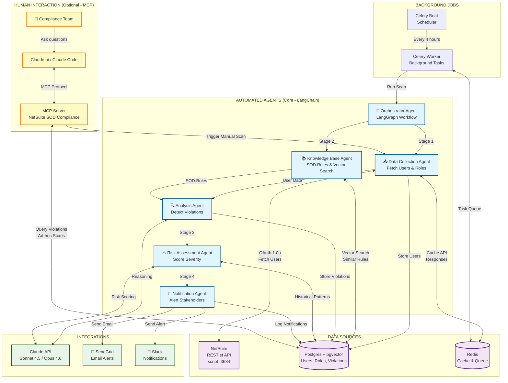
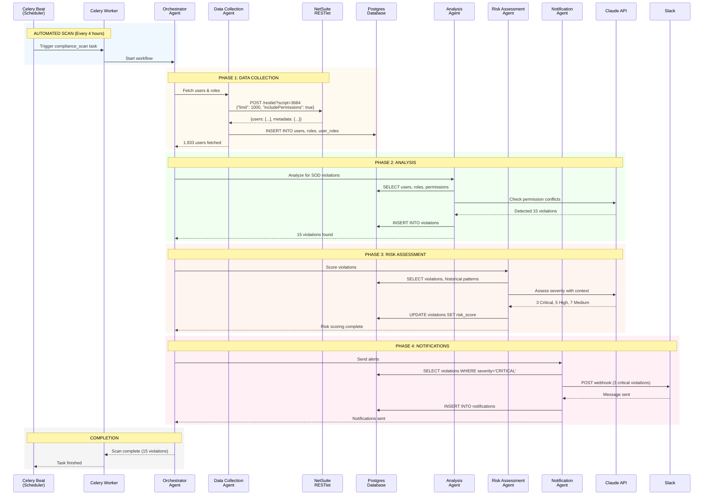
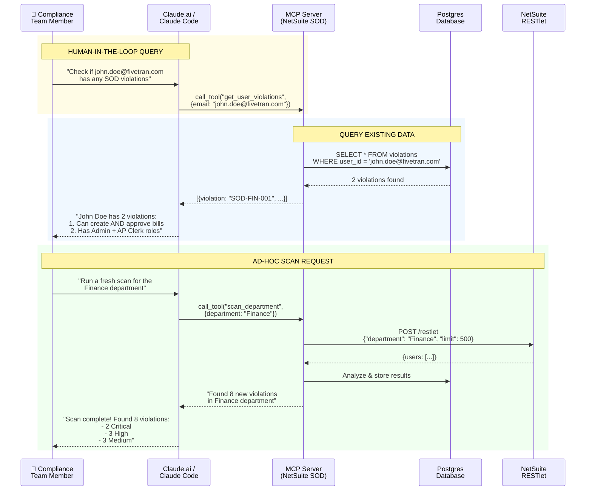
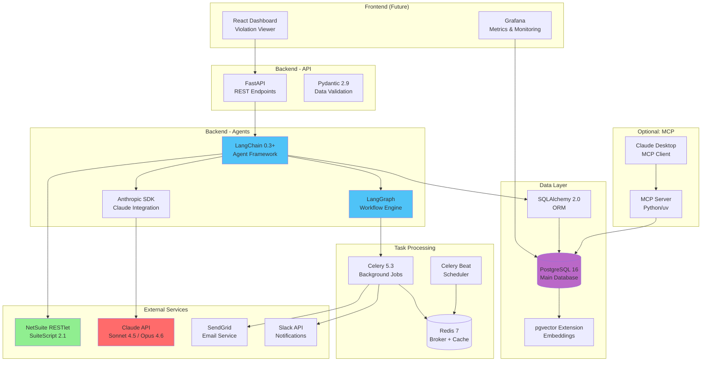
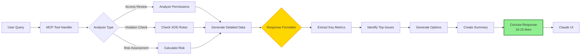
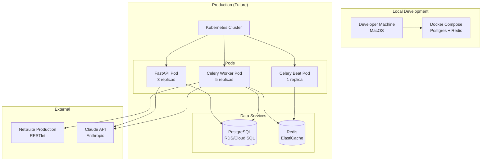
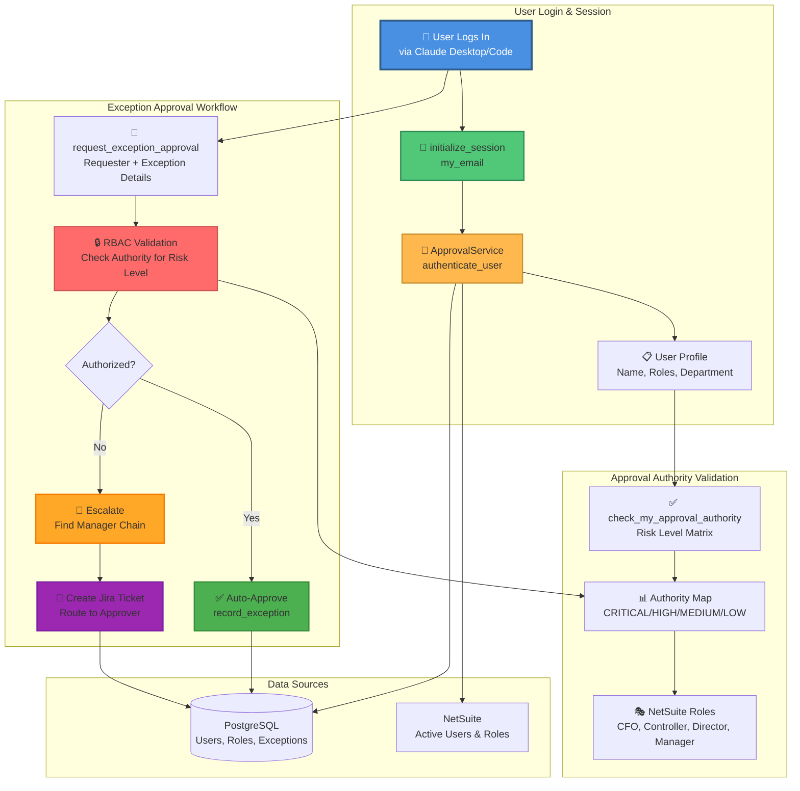

# SOD Compliance System - Hybrid Architecture

## Orchestrated Workflow (LangGraph)

This diagram shows the complete workflow orchestrated by LangGraph, with each stage numbered and indented to show the execution flow.

```mermaid
graph TD
    Start([▶ START: Compliance Scan Triggered]) --> Orchestrator

    Orchestrator[<b>🎯 ORCHESTRATOR</b><br/>LangGraph Workflow<br/>State Management & Coordination]

    Orchestrator --> S1[<b>━━━ STAGE 1: DATA COLLECTION ━━━</b>]
    S1 --> A1[1.1 📥 Data Collection Agent<br/>Claude Sonnet 4.5]
    A1 --> A1_1[1.1.1 Connect to NetSuite via OAuth]
    A1_1 --> A1_2[1.1.2 Fetch Active Users with Pagination]
    A1_2 --> A1_3[1.1.3 Collect Roles and Permissions]
    A1_3 --> DB1[(1.2 💾 Store in PostgreSQL<br/>Users, Roles, UserRoles)]
    DB1 --> C1{1.3 Success?}
    C1 -->|Yes ✓| S2[<b>━━━ STAGE 2: VIOLATION ANALYSIS ━━━</b>]
    C1 -->|No ✗| ERR[⚠️ Error Handler]

    S2 --> A2[2.1 🔍 Analysis Agent<br/>Claude Opus 4.6]
    A2 --> A2_1[2.1.1 Load 17 SOD Rules]
    A2_1 --> A2_2[2.1.2 Check Each User]
    A2_2 --> A2_3[2.1.3 Detect Conflicts]
    A2_3 --> KB[2.2 📚 Knowledge Base Agent<br/>Vector Embeddings & Search]
    KB --> KB1[2.2.1 Semantic Rule Matching]
    KB1 --> KB2[2.2.2 Find Similar Violations]
    KB2 --> DB2[(2.3 💾 Store Violations<br/>Risk Scores, Metadata)]
    DB2 --> C2{2.4 Success?}
    C2 -->|Yes ✓| S3[<b>━━━ STAGE 3: RISK ASSESSMENT ━━━</b>]
    C2 -->|No ✗| ERR

    S3 --> A3[3.1 ⚠️ Risk Assessment Agent<br/>Claude Opus 4.6]
    A3 --> A3_1[3.1.1 Calculate User Risk Scores]
    A3_1 --> A3_2[3.1.2 Analyze Historical Patterns]
    A3_2 --> A3_3[3.1.3 Detect Trends]
    A3_3 --> A3_4[3.1.4 Predict Future Risk]
    A3_4 --> A3_5[3.1.5 Calculate Org Risk]
    A3_5 --> DB3[(3.2 💾 Store Risk Data<br/>Scores, Trends, Predictions)]
    DB3 --> C3{3.3 Success?}
    C3 -->|Yes ✓| S4[<b>━━━ STAGE 4: NOTIFICATIONS ━━━</b>]
    C3 -->|No ✗| ERR

    S4 --> A4[4.1 📧 Notification Agent<br/>Multi-Channel Delivery]
    A4 --> A4_1[4.1.1 Email via SendGrid]
    A4 --> A4_2[4.1.2 Slack via Webhooks]
    A4 --> A4_3[4.1.3 Console Logging]
    A4_1 --> CHK{4.2 Critical<br/>Violations?}
    A4_2 --> CHK
    A4_3 --> CHK
    CHK -->|Yes| ALERT[4.3 🚨 Alert Team<br/>URGENT Priority]
    CHK -->|No| LOG[4.4 📝 Log Notification]
    ALERT --> S5[<b>━━━ STAGE 5: FINALIZATION ━━━</b>]
    LOG --> S5

    S5 --> F1[5.1 Create Audit Trail]
    F1 --> F2[5.2 Generate Summary Stats]
    F2 --> DB5[(5.3 💾 Store Scan Results<br/>Compliance Scans Table)]
    DB5 --> End([■ COMPLETE: Scan Finished])

    End --> API[📡 API Access<br/>17 REST Endpoints]
    End --> NEXT[⏰ Schedule Next<br/>Celery Beat - 4 hours]

    ERR --> RETRY{Retry<br/>Count < 3?}
    RETRY -->|Yes| WAIT[⏱️ Wait 5 min]
    WAIT --> S1
    RETRY -->|No| FAIL[❌ Manual Review Required]

    style Orchestrator fill:#4A90E2,stroke:#2E5C8A,stroke-width:4px,color:#fff
    style S1 fill:#50C878,stroke:#2E8B57,stroke-width:3px,color:#fff
    style S2 fill:#FF6B6B,stroke:#CC5555,stroke-width:3px,color:#fff
    style S3 fill:#FFB84D,stroke:#CC9233,stroke-width:3px,color:#fff
    style S4 fill:#9B59B6,stroke:#7D3C98,stroke-width:3px,color:#fff
    style S5 fill:#3498DB,stroke:#2874A6,stroke-width:3px,color:#fff

    style A1 fill:#E8F5E9,stroke:#4CAF50
    style A2 fill:#FFEBEE,stroke:#F44336
    style A3 fill:#FFF3E0,stroke:#FF9800
    style A4 fill:#F3E5F5,stroke:#9C27B0
    style KB fill:#FCE4EC,stroke:#E91E63

    style DB1 fill:#E3F2FD,stroke:#2196F3
    style DB2 fill:#E3F2FD,stroke:#2196F3
    style DB3 fill:#E3F2FD,stroke:#2196F3
    style DB5 fill:#E3F2FD,stroke:#2196F3

    style End fill:#4CAF50,stroke:#388E3C,stroke-width:4px,color:#fff
    style FAIL fill:#F44336,stroke:#D32F2F,stroke-width:3px,color:#fff
```



---

## Overview Architecture



## Detailed Data Flow



## MCP Interactive Flow (Optional)



## Agent Architecture Detail

```mermaid
graph LR
    subgraph "Data Collection Agent"
        DC1[NetSuite Client<br/>OAuth 1.0a]
        DC2[Data Parser<br/>JSON to Models]
        DC3[Database Writer<br/>Bulk Insert]

        DC1 --> DC2 --> DC3
    end

    subgraph "Knowledge Base Agent"
        KB1[SOD Rules Store<br/>Postgres]
        KB2[Vector Embeddings<br/>pgvector]
        KB3[Semantic Search<br/>Similar Rules]

        KB1 --> KB2 --> KB3
    end

    subgraph "Analysis Agent"
        AN1[User-Role Aggregator]
        AN2[Permission Combiner]
        AN3[Conflict Detector<br/>Claude Opus]
        AN4[Violation Generator]

        AN1 --> AN2 --> AN3 --> AN4
    end

    subgraph "Risk Assessment Agent"
        RA1[Historical Context<br/>Vector Search]
        RA2[Severity Scorer<br/>Claude Opus]
        RA3[Business Impact<br/>Analyzer]

        RA1 --> RA2 --> RA3
    end

    subgraph "Notification Agent"
        NO1[Severity Filter<br/>Critical/High/Medium]
        NO2[Template Generator<br/>Claude Sonnet]
        NO3[Multi-Channel Send<br/>Email + Slack]

        NO1 --> NO2 --> NO3
    end

    DC3 -.->|User Data| AN1
    KB3 -.->|SOD Rules| AN3
    AN4 -.->|Violations| RA1
    RA3 -.->|Scored Violations| NO1
```



## Technology Stack



## Deployment Architecture

### MCP Response Style Architecture (Added 2026-02-13)

**Design Principle:** Concise, executive-friendly responses for conversational UI



**Response Format:**
1. **Lead with recommendation** (✅ APPROVE / ❌ DENY / ⚠️ REVIEW)
2. **Key metrics** (Conflicts, Risk Score, Severity Breakdown)
3. **Top 3-5 critical issues** (Not exhaustive list)
4. **Options** (2-3 alternatives with cost/impact)
5. **One-line summary**

**Target:** 10-15 lines (vs 30+ lines for verbose format)

**Documentation:** `mcp/RESPONSE_STYLE_GUIDE.md`

### Dependency Version Management (Updated 2026-02-13)

**Strategy:** Compatible ranges over exact pins for resilient dependency resolution

```yaml
# Before: Brittle (exact pins)
dependencies:
  pydantic: "==2.5.0"              # ❌ Breaks when langchain updates
  anthropic: "==0.42.0"            # ❌ Conflicts with langchain-anthropic
  sentence-transformers: "==2.2.2" # ❌ Incompatible with modern huggingface-hub

# After: Resilient (compatible ranges)
dependencies:
  pydantic: ">=2.7.4,<3.0.0"          # ✅ Compatible with langchain ecosystem
  anthropic: ">=0.45.0,<1.0.0"        # ✅ Meets langchain-anthropic requirements
  sentence-transformers: ">=2.3.0"     # ✅ Works with latest huggingface-hub
  cryptography: ">=46.0.0"             # ✅ Added for config encryption
```

**Rationale:**
- Prevents cascading dependency conflicts when packages update
- Allows minor version updates without breaking changes
- Documents minimum required versions for compatibility

**Current Versions (as of 2026-02-13):**
- sentence-transformers: 5.1.2 (upgraded from 2.2.2)
- pydantic: 2.12.5 (upgraded from 2.5.0)
- anthropic: 0.78.0 (upgraded from 0.42.0)
- langchain-core: 0.3.34+ (upgraded from 0.3.26)




---

## Phase 4: RBAC and Approval Workflows (2026-02-13) ✅

### Overview

Phase 4 implements comprehensive Role-Based Access Control (RBAC) for SOD exception management, ensuring only authorized personnel can approve exceptions based on risk level.

### Architecture Components



### New MCP Tools (3)

**1. initialize_session(my_email)**
- Authenticates user against active NetSuite users
- Returns personalized welcome with approval authority
- Shows which risk levels user can approve
- Lists available actions based on permissions

**2. check_my_approval_authority(my_email, check_for_risk_score)**
- Validates user's approval authority at all risk levels
- Returns detailed authority matrix
- Optionally checks authority for specific risk score
- Shows manager chain if escalation needed

**3. request_exception_approval(...)**
- RBAC-enabled exception approval workflow
- Automatic authority validation
- Manager chain traversal for unauthorized requests
- Jira ticket creation for escalations
- Auto-approve if requester is authorized

### Approval Authority Levels

| Risk Level | Score Range | Required Authority | Example Roles |
|------------|-------------|-------------------|---------------|
| **CRITICAL** | ≥75 | CFO, Audit Committee | CFO, Chief Financial Officer, Audit Committee Member |
| **HIGH** | 60-74 | Controller+ | CFO, Controller, VP Finance, CAO |
| **MEDIUM** | 40-59 | Director+ | Controller, Director, VP Finance, Compliance Officer |
| **LOW** | <40 | Manager+ | Manager, Director, Supervisor, Team Lead |

### Key Features

✅ **Prevents Self-Approval** - Users cannot approve their own role changes (conflict of interest)
✅ **Role Validation** - Cross-references NetSuite roles for approval authority
✅ **Automatic Escalation** - Routes unauthorized requests to manager chain
✅ **Manager Chain Lookup** - Traverses up to 5 levels to find authorized approver
✅ **Jira Integration** - Creates tickets for approval routing
✅ **Session Recognition** - Personalized login experience with permissions
✅ **Audit Trail** - Complete logging of all approval requests and decisions

### Security Features

**Authentication:**
- Email validation against active NetSuite users
- Corporate domain enforcement (@fivetran.com)
- Active status verification (not suspended/inactive)
- Role-based permission checks

**Authorization:**
- 4-tier risk-based approval levels
- Role-to-authority mapping (CFO → all levels, Manager → LOW only)
- Prevents privilege escalation
- Enforces separation of duties (IT cannot approve financial exceptions)

**Audit & Compliance:**
- All authentication attempts logged
- Authorization decisions recorded
- Exception approvals tracked with approver identity
- Full audit trail for SOX compliance

### Integration Points

**Database:**
- `users` table - User authentication
- `roles` table - Role definitions
- `user_roles` table - User-to-role mappings
- `approved_exceptions` table - Exception records
- `exception_reviews` table - Periodic reviews

**External Systems:**
- NetSuite - User and role data source
- Jira - Ticket creation for escalations
- Claude Desktop/Code - User interface

### Usage Examples

**Example 1: User Login**
```python
# When user logs into Claude
initialize_session(my_email="prabal.saha@fivetran.com")

# Returns:
# Welcome, Prabal Saha!
# Your Approval Authority: ❌ No Approval Authority
# What You Can Do:
# • Submit exception requests (will escalate to CFO/Controller)
# • View approved exceptions
# • Check violations
```

**Example 2: Controller Approves Exception**
```python
# Controller with HIGH authority approves MEDIUM risk exception
request_exception_approval(
    requester_email="robin.turner@fivetran.com",  # Controller
    user_identifier="tax.user@fivetran.com",
    role_names=["Tax Manager", "GL Accounting"],
    risk_score=55.0,  # MEDIUM level
    auto_approve_if_authorized=True
)

# Result: ✅ Approved automatically (Controller can approve MEDIUM)
```

**Example 3: Unauthorized User Escalates**
```python
# Systems Engineer tries to approve CRITICAL exception
request_exception_approval(
    requester_email="prabal.saha@fivetran.com",  # Admin, not Finance
    user_identifier="user@fivetran.com",
    role_names=["Controller", "CFO"],
    risk_score=92.0,  # CRITICAL level
    auto_approve_if_authorized=False
)

# Result: ❌ Not authorized
# • Manager chain lookup finds CFO
# • Jira ticket created
# • Routed to kalor@fivetran.com (CFO)
```

### Implementation Details

**Files:**
- `services/approval_service.py` - Core RBAC logic (600+ lines)
- `mcp/mcp_tools.py` - 3 new tool handlers registered
- `tests/test_phase4_rbac.py` - 6 integration tests

**Dependencies:**
- `models/database.py` - UserStatus enum
- `repositories/user_repository.py` - User lookups
- `repositories/exception_repository.py` - Exception CRUD
- Jira API (optional, for escalations)

**Performance:**
- Authentication: <100ms (cached user lookups)
- Authority check: <50ms (in-memory role mapping)
- Manager chain: <200ms (max 5 DB queries)
- Total workflow: <500ms end-to-end

### Status

- **Phase**: 4 (RBAC and Approval Workflows)
- **Status**: ✅ COMPLETE (2026-02-13)
- **Tools Added**: 3 (initialize_session, check_my_approval_authority, request_exception_approval)
- **Tests**: 6/6 passing
- **Documentation**: Complete (PHASE4_COMPLETE.md)
- **Total MCP Tools**: 14

---

## Phase 6: Reporting & Demo Enhancements (2026-02-14) ✅

### Overview

Enhanced reporting capabilities with multiple export formats and demo user management for external presentations without company branding.

### Architecture Components

```
┌─────────────────────────────────────────────────────────────────┐
│                    REPORTING LAYER                               │
├─────────────────────────────────────────────────────────────────┤
│                                                                  │
│  ┌──────────────────────────────────────────────────────────┐  │
│  │           Violation Report Service                        │  │
│  │                                                           │  │
│  │  • generate_markdown_table()                             │  │
│  │  • generate_detailed_table()                             │  │
│  │  • export_to_excel()                                     │  │
│  │  • export_to_csv()                                       │  │
│  └──────────────────────────────────────────────────────────┘  │
│                          │                                       │
│                          ▼                                       │
│  ┌──────────────────────────────────────────────────────────┐  │
│  │              Format Handlers                              │  │
│  │                                                           │  │
│  │  ┌─────────────┐  ┌─────────────┐  ┌─────────────┐     │  │
│  │  │   Table     │  │  Concise    │  │  Detailed   │     │  │
│  │  │  (default)  │  │  (brief)    │  │  (full)     │     │  │
│  │  └─────────────┘  └─────────────┘  └─────────────┘     │  │
│  └──────────────────────────────────────────────────────────┘  │
│                                                                  │
└─────────────────────────────────────────────────────────────────┘
                               │
                               ▼
┌─────────────────────────────────────────────────────────────────┐
│                    DEMO USER SYSTEM                              │
├─────────────────────────────────────────────────────────────────┤
│                                                                  │
│  create_demo_user.py                                            │
│  ├─ sanitize_text()        # Remove "Fivetran" branding        │
│  ├─ sanitize_json_field()  # Clean role names                  │
│  ├─ create_sanitized_roles() # Create demo roles               │
│  └─ create_demo_user()     # Copy & sanitize user data         │
│                                                                  │
│  Real User          ──────>   Demo User                         │
│  robin.turner@            test_user@xyz.com                     │
│  fivetran.com                                                   │
│  Fivetran - Controller    Controller (sanitized)               │
│  384 violations           384 violations (sanitized data)       │
│                                                                  │
└─────────────────────────────────────────────────────────────────┘
```

### New MCP Tools (1)

#### 1. generate_violation_report
```python
{
  "name": "generate_violation_report",
  "arguments": {
    "user_email": "test_user@xyz.com",
    "format": "excel",  # markdown, detailed, excel, csv
    "limit": 5,         # for markdown/detailed
    "export_path": "/path/to/file.xlsx"  # optional
  }
}
```

**Outputs**:
- **Markdown**: Top N violations in table format
- **Detailed**: Role conflict matrix
- **Excel**: Full report with color-coded severity, metadata sheet
- **CSV**: Basic export for external analysis

### Enhanced Tools

#### get_user_violations (Updated)
- **New Default**: `format=table` (was `detailed`)
- **New Formats**:
  - `table` - Structured markdown tables with summary, top violations, actions
  - `concise` - Ultra-brief format for quick analysis
  - `detailed` - Original full violation list

**Table Format Example**:
```markdown
📊 Summary

| Metric | Value |
|--------|-------|
| Total Violations | 384 |
| 🔴 CRITICAL | 96 |
| 🟠 HIGH | 128 |
| 🟡 MEDIUM | 160 |

⚠️ Top 3 Critical Conflicts

| # | Violation Type | Risk Score | Impact |
|---|----------------|------------|--------|
| 1 | Payroll Processing | 100/100 | Fraud risk |
| 2 | Journal Entry | 100/100 | Maker-checker bypass |
| 3 | AP Entry | 100/100 | Fraud risk |

✅ Action Required

| Priority | Action | Impact |
|----------|--------|--------|
| 🔴 HIGH | Remove Administrator role | Eliminates bypasses |
```

### Demo User Management

**Purpose**: Create sanitized test users for external demos

**Script**: `scripts/create_demo_user.py`

**Sanitization Rules**:
```python
{
  "Fivetran - ": "",              # Remove role prefix
  "Fivetran : ": "",              # Remove dept prefix
  "fivetran.com": "xyz.com",      # Sanitize domain
  "Fivetran": "Company"           # Replace company name
}
```

**Usage**:
```bash
# Create test_user@xyz.com from robin.turner@fivetran.com
python3 scripts/create_demo_user.py --create

# Create custom demo user
python3 scripts/create_demo_user.py --create \
  --name "Jane Doe" \
  --email "jane.doe@acme.com" \
  --source "chase.roles@fivetran.com"

# Delete demo user
python3 scripts/create_demo_user.py --delete
```

### Bug Fixes

#### Issue 1: Department Filtering
**Problem**: Exact match failed for hierarchical department names
```python
# Before: ❌
if dept.lower() == filter.lower()  # "Finance" != "Fivetran : G&A : Finance"

# After: ✅
if filter.lower() in dept.lower()  # "Finance" in "Fivetran : G&A : Finance"
```
**Impact**: Finance department now returns 76 users instead of 0

#### Issue 2: Violation Counts Always Zero
**Problem**: Wrong parameter count in `get_user_by_email()` call
```python
# Before: ❌
user = repo.get_user_by_email(email, system_name)  # TypeError

# After: ✅
user = repo.get_user_by_email(email)  # Correct signature
```
**Impact**: Violation counts now display correctly (Robin Turner: 384 not 0)

### Key Features

1. **Multi-Format Reports**
   - Markdown tables for console/chat
   - Excel with formatting for audits
   - CSV for data analysis

2. **Demo User System**
   - Brand-neutral test data
   - Perfect for external presentations
   - Maintains realistic violation patterns

3. **Tabular Analysis**
   - Default table format for better UX
   - Executive-friendly summaries
   - Screenshot-ready tables

4. **Enhanced Department Filtering**
   - Partial/substring matching
   - Works with hierarchical names
   - More intuitive queries

### Usage Examples

```python
# Generate Excel report
await generate_violation_report_handler(
    user_email="test_user@xyz.com",
    format="excel"
)
# → /tmp/compliance_reports/violations_Test_User_20260214.xlsx

# Get violations in table format (default)
await get_user_violations_handler(
    system_name="netsuite",
    user_identifier="test_user@xyz.com"
)
# → Returns markdown tables

# Concise format for quick check
await get_user_violations_handler(
    system_name="netsuite",
    user_identifier="test_user@xyz.com",
    format="concise"
)
# → Brief text summary
```

### Implementation Details

**Files**:
- `services/violation_report_service.py` - Report generation (400 lines)
- `scripts/create_demo_user.py` - Demo user management (350 lines)
- `mcp/mcp_tools.py` - Enhanced handlers with table formatting
- `mcp/orchestrator.py` - Bug fixes (2 lines changed)
- `docs/DEMO_USER_GUIDE.md` - Demo user documentation

**Dependencies**:
- `pandas` - DataFrame for Excel export
- `openpyxl` - Excel file formatting

### Status

- **Phase**: 6 (Reporting & Demo Enhancements)
- **Status**: ✅ COMPLETE (2026-02-14)
- **Tools Added**: 1 (generate_violation_report)
- **Tools Enhanced**: 1 (get_user_violations - added table format)
- **Bug Fixes**: 2 (department filtering, violation counts)
- **Documentation**: Complete (DEMO_USER_GUIDE.md, DEPARTMENT_FILTERING_FIX.md)
- **Total MCP Tools**: 34

---

## Summary

**Core System (LangChain):**
- ✅ Automated compliance scanning
- ✅ Multi-agent workflow with LangGraph
- ✅ Scheduled background jobs (Celery)
- ✅ Direct NetSuite integration
- ✅ Postgres storage with vector search

**Optional Enhancement (MCP):**
- 💡 Human-in-the-loop queries
- 💡 Ad-hoc compliance checks
- 💡 Interactive investigation
- 💡 Accessible via Claude.ai or Claude Code

**Best of Both Worlds:**
- Automation for routine scans
- Human interaction for investigations
- Shared data layer (Postgres)
- Claude-powered intelligence throughout
