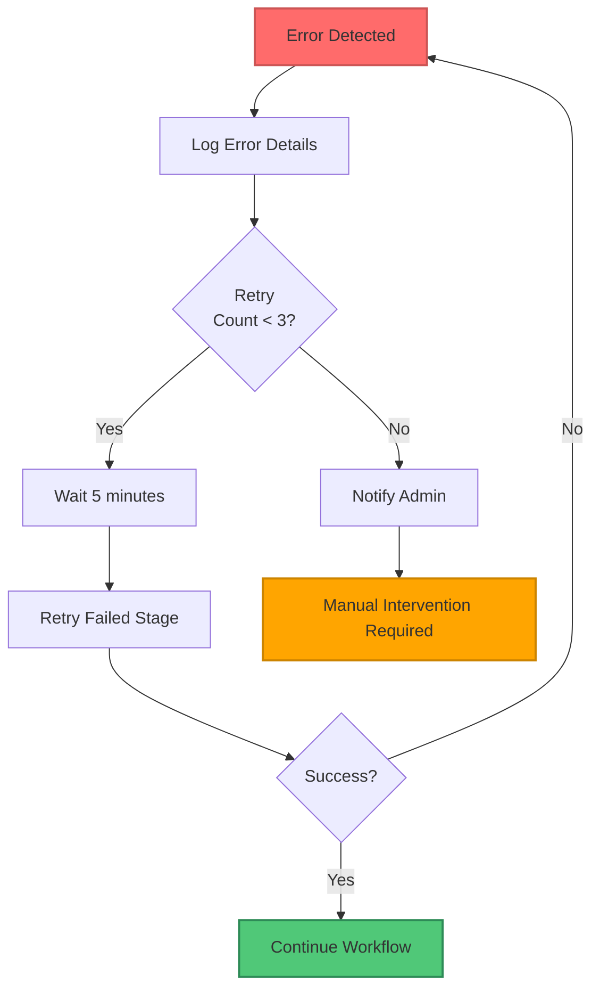
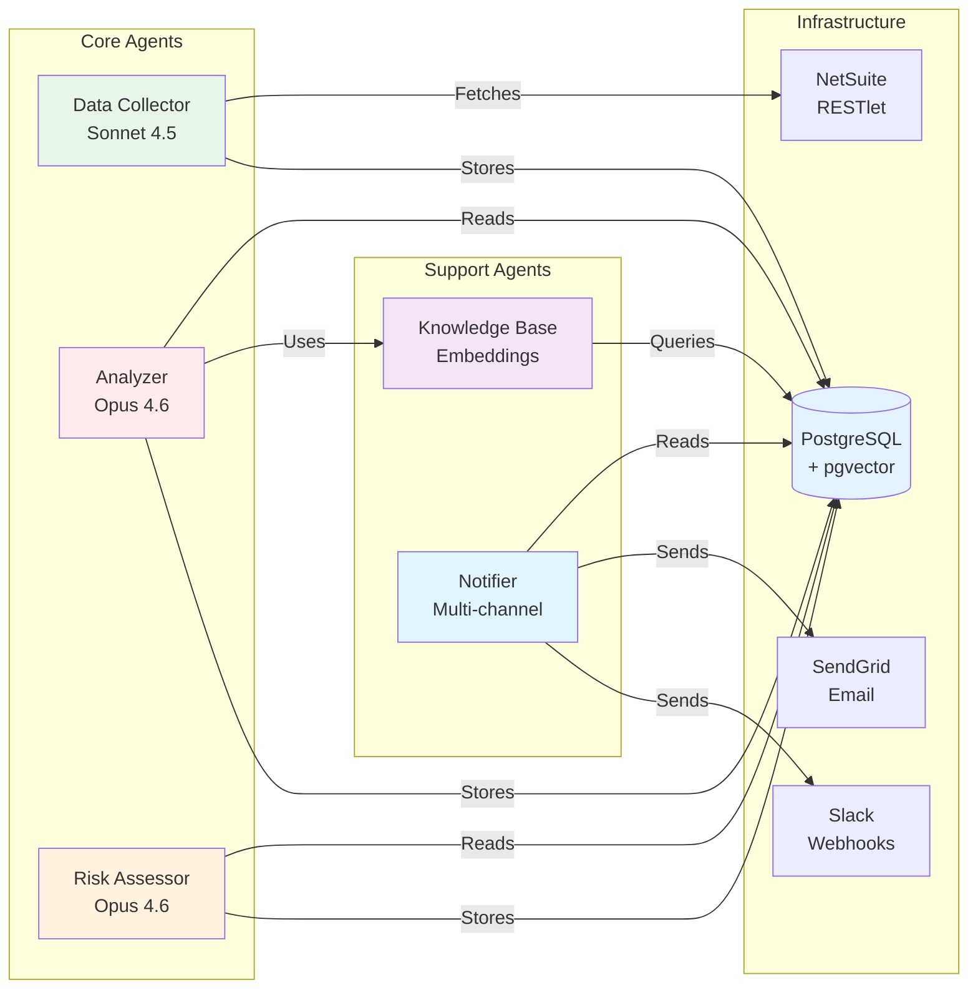

# SOD Compliance System - Workflow Diagram

## Complete Workflow Architecture

This diagram shows the complete compliance workflow orchestrated by LangGraph, with each stage numbered sequentially.

```mermaid
graph TD
    Start([Start: Trigger Compliance Scan]) --> Orchestrator

    Orchestrator[<b>Orchestrator</b><br/>LangGraph Workflow Coordinator<br/>Multi-Agent State Management]

    Orchestrator --> Stage1[<b>STAGE 1: Data Collection</b>]
    Stage1 --> Agent1[1.1 Data Collection Agent<br/>Claude Sonnet 4.5<br/>Fetch users from NetSuite]
    Agent1 --> Store1[(1.2 Store in PostgreSQL<br/>Users, Roles, Permissions)]
    Store1 --> Check1{1.3 Success?}
    Check1 -->|Yes| Stage2[<b>STAGE 2: Violation Analysis</b>]
    Check1 -->|No| Error[Error Handler<br/>Retry Logic]
    Error --> Stage1

    Stage2 --> Agent2[2.1 Analysis Agent<br/>Claude Opus 4.6<br/>Check 17 SOD Rules]
    Agent2 --> KB[2.2 Knowledge Base Agent<br/>Vector Embeddings<br/>Rule Matching]
    KB --> Store2[(2.3 Store Violations<br/>Risk Scores, Metadata)]
    Store2 --> Check2{2.4 Success?}
    Check2 -->|Yes| Stage3[<b>STAGE 3: Risk Assessment</b>]
    Check2 -->|No| Error

    Stage3 --> Agent3[3.1 Risk Assessment Agent<br/>Claude Opus 4.6<br/>Calculate Risk Scores]
    Agent3 --> Trends[3.2 Trend Analysis<br/>Historical Patterns<br/>Future Predictions]
    Trends --> OrgRisk[3.3 Organization Risk<br/>Risk Distribution<br/>Business Impact]
    OrgRisk --> Store3[(3.4 Store Risk Data<br/>Scores, Trends, Recommendations)]
    Store3 --> Check3{3.5 Success?}
    Check3 -->|Yes| Stage4[<b>STAGE 4: Notifications</b>]
    Check3 -->|No| Error

    Stage4 --> Agent4[4.1 Notification Agent<br/>Multi-Channel Delivery]
    Agent4 --> Email[4.2 Email<br/>SendGrid<br/>HTML Templates]
    Agent4 --> Slack[4.3 Slack<br/>Webhooks<br/>Formatted Messages]
    Agent4 --> Console[4.4 Console<br/>Fallback Logging]
    Email --> Notify{4.5 Critical<br/>Violations?}
    Slack --> Notify
    Console --> Notify
    Notify -->|Yes| AlertTeam[4.6 Alert Compliance Team<br/>URGENT Priority]
    Notify -->|No| LogNotify[4.7 Log Notification]
    AlertTeam --> Stage5[<b>STAGE 5: Finalization</b>]
    LogNotify --> Stage5

    Stage5 --> Audit[5.1 Create Audit Trail<br/>Timestamp, Stats, Errors]
    Audit --> Summary[5.2 Generate Summary<br/>Users, Violations, Duration]
    Summary --> Store5[(5.3 Store Scan Results<br/>Compliance Scan Table)]
    Store5 --> Complete([Complete: Scan Finished])

    Complete --> API[Access Results via API<br/>17 REST Endpoints]
    Complete --> Celery[Schedule Next Scan<br/>Celery Beat - 4 hours]

    style Orchestrator fill:#4A90E2,stroke:#2E5C8A,stroke-width:3px,color:#fff
    style Stage1 fill:#50C878,stroke:#2E8B57,stroke-width:2px,color:#fff
    style Stage2 fill:#FF6B6B,stroke:#CC5555,stroke-width:2px,color:#fff
    style Stage3 fill:#FFB84D,stroke:#CC9233,stroke-width:2px,color:#fff
    style Stage4 fill:#9B59B6,stroke:#7D3C98,stroke-width:2px,color:#fff
    style Stage5 fill:#3498DB,stroke:#2874A6,stroke-width:2px,color:#fff

    style Agent1 fill:#E8F5E9
    style Agent2 fill:#FFEBEE
    style Agent3 fill:#FFF3E0
    style Agent4 fill:#F3E5F5
    style KB fill:#FFEBEE

    style Store1 fill:#E3F2FD
    style Store2 fill:#E3F2FD
    style Store3 fill:#E3F2FD
    style Store5 fill:#E3F2FD

    style Complete fill:#4CAF50,stroke:#388E3C,stroke-width:3px,color:#fff
```



---

## Workflow Details

### **Orchestrator** (Entry Point)
- **Technology**: LangGraph StateGraph
- **Role**: Coordinates all 6 agents through 5 stages
- **State Management**: Tracks progress, errors, statistics
- **Error Handling**: Automatic retry logic for failures

---

### **Stage 1: Data Collection** 🟢
```
1.1 Data Collection Agent (Sonnet 4.5)
    ├─ Connect to NetSuite via OAuth 1.0a
    ├─ Fetch active users with pagination
    └─ Collect roles and permissions

1.2 Store in PostgreSQL
    ├─ Insert/update users
    ├─ Insert/update roles
    └─ Create user-role assignments

1.3 Success Check
    ├─ Yes → Proceed to Stage 2
    └─ No → Error Handler → Retry
```

**Output**: Users stored in database with complete access data

---

### **Stage 2: Violation Analysis** 🔴
```
2.1 Analysis Agent (Opus 4.6)
    ├─ Load 17 SOD rules
    ├─ Analyze each user
    └─ Detect conflicts

2.2 Knowledge Base Agent
    ├─ Search similar rules (vector embeddings)
    ├─ Match permissions to rules
    └─ Provide rule explanations

2.3 Store Violations
    ├─ Insert violations with metadata
    ├─ Calculate risk scores (0-100)
    └─ Link to users and rules

2.4 Success Check
    ├─ Yes → Proceed to Stage 3
    └─ No → Error Handler → Retry
```

**Output**: Violations detected and stored with risk scores

---

### **Stage 3: Risk Assessment** 🟠
```
3.1 Risk Assessment Agent (Opus 4.6)
    ├─ Calculate individual user risk
    ├─ Apply multi-factor scoring
    └─ Determine risk levels

3.2 Trend Analysis
    ├─ Analyze historical patterns
    ├─ Detect trends (INCREASING/STABLE/DECREASING)
    └─ Predict future risk (30/60/90 days)

3.3 Organization Risk
    ├─ Calculate org-wide risk score
    ├─ Analyze risk distribution
    └─ Assess business impact

3.4 Store Risk Data
    ├─ Save risk scores
    ├─ Save trend analysis
    └─ Save recommendations

3.5 Success Check
    ├─ Yes → Proceed to Stage 4
    └─ No → Error Handler → Retry
```

**Output**: Complete risk assessment with trends and predictions

---

### **Stage 4: Notifications** 🟣
```
4.1 Notification Agent
    └─ Multi-channel delivery system

4.2 Email Channel (SendGrid)
    ├─ Generate HTML templates
    ├─ Send to compliance team
    └─ Track delivery status

4.3 Slack Channel (Webhooks)
    ├─ Format messages with colors
    ├─ Post to #compliance-alerts
    └─ Include action buttons

4.4 Console Channel (Fallback)
    └─ Log to console/file

4.5 Check Severity
    ├─ Critical violations?
    └─ Route based on priority

4.6 Alert Team (if critical)
    ├─ URGENT priority
    ├─ Immediate action required
    └─ Escalation workflow

4.7 Log Notification
    └─ Record in notification table
```

**Output**: Stakeholders notified via email, Slack, or console

---

### **Stage 5: Finalization** 🔵
```
5.1 Create Audit Trail
    ├─ Log scan ID
    ├─ Timestamp start/end
    └─ Record errors (if any)

5.2 Generate Summary
    ├─ Users analyzed count
    ├─ Violations detected count
    ├─ Duration in seconds
    └─ Error list

5.3 Store Scan Results
    └─ Save to compliance_scans table

Complete
    ├─ Return results to caller
    └─ Trigger cleanup tasks
```

**Output**: Complete scan record with audit trail

---

## Post-Workflow Actions

### **API Access**
- Results available via 17 REST endpoints
- Real-time queries for violations, risk scores
- Dashboard statistics

### **Scheduled Next Scan**
- Celery Beat schedules next scan (4 hours)
- Background tasks continue monitoring
- Continuous compliance

---

## Error Handling Flow



---

## State Management

The Orchestrator maintains workflow state throughout execution:

```python
WorkflowState = {
    'stage': 'INIT | COLLECT_DATA | ANALYZE_VIOLATIONS | ASSESS_RISK | SEND_NOTIFICATIONS | COMPLETE',
    'scan_id': 'unique_scan_identifier',
    'users_collected': 0,
    'violations_detected': 0,
    'notifications_sent': 0,
    'errors': [],
    'results': {
        'data_collection': {...},
        'analysis': {...},
        'risk_assessment': {...},
        'notifications': {...}
    },
    'start_time': datetime,
    'end_time': datetime
}
```

---

## Agent Dependencies



---

## Execution Timeline

**Typical Scan Duration: 60-80 seconds**

```
Stage 1: Data Collection       [████████░░░░░░░░░░░░] 30-40s (50%)
Stage 2: Violation Analysis    [████████░░░░░░░░░░░░] 15-20s (25%)
Stage 3: Risk Assessment       [████░░░░░░░░░░░░░░░░] 10-15s (15%)
Stage 4: Notifications         [██░░░░░░░░░░░░░░░░░░]  2-5s  (5%)
Stage 5: Finalization          [█░░░░░░░░░░░░░░░░░░░]  1-2s  (3%)
```

---

## Monitoring & Observability

### Real-Time Monitoring
- **API**: `GET /health` - System health
- **Celery**: Flower dashboard - Task status
- **Logs**: Console + file logging
- **Metrics**: Custom metrics per stage

### Alerts
- **Critical Violations**: Immediate Slack/Email
- **Scan Failures**: Admin notification
- **Performance Issues**: Monitoring alerts
- **Resource Limits**: Threshold warnings

---

## Production Deployment

### Horizontal Scaling
```
Orchestrator ────┬──── Worker 1 (Stage 1-2)
                 ├──── Worker 2 (Stage 3-4)
                 └──── Worker 3 (Stage 5)

Load Balancer ───┬──── API Instance 1
                 ├──── API Instance 2
                 └──── API Instance 3

Redis Cluster ───┬──── Master
                 └──── Replicas
```

### High Availability
- Multiple orchestrator instances
- Database read replicas
- Redis cluster mode
- API load balancing
- Celery worker pools

---

**Created**: 2026-02-09
**Status**: Production Ready
**Version**: 1.0.0
